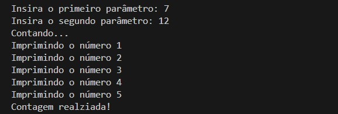
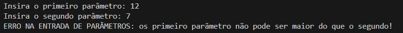
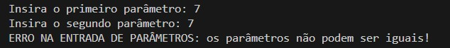

# DIO Trilha Java Básico - Desafio de Controle de Fluxo

Autor: [Marcos Lucas](https://github.com/lmarcosz)

O objetivo principal deste desafio foi compreender melhor o funcionamento dos controles de fluxo condicionais, laços de repetição e tratamento de exceções na linguagem Java, aplicando-os em um projeto. Além disso, foi possível colocar em prática os conceitos de Git, GitHub e documentação.

## Proposta do Desafio: Contador

Implementar um sistema que recebe dois parâmetros via terminal, realiza uma contagem sequencial do primeiro parâmetro até o segundo e exibe no console os números contados. A contagem deve sempre iniciar do número 1.

- Os parâmetros devem ser números inteiros;
- O primeiro parâmetro deve ser menor do que o segundo. Caso essa condição não seja satisfeita, o sistema deverá exibir uma mensagem de erro no console e a contagem não será feita;
- A contagem é de 1 em 1 (sempre começando do número 1).

## Resultados

### Cenário 1
Funcionamento esperado do sistema de contagem. Exemplo de inserção: 7 e 12.

### Cenário 2
Mensagem de erro (exceção) caso o primeiro parâmetro seja maior do que o segundo. Exemplo de inserção: 12 e 7.

### Cenário 3
Mensagem de erro (exceção) caso o primeiro parâmetro seja igual ao segundo. Exemplo de inserção: 7 e 7.

## Links úteis

- [Markdown do desafio](https://github.com/digitalinnovationone/trilha-java-basico/tree/main/desafios/controle-fluxo)